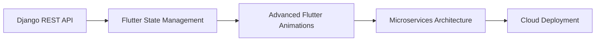

  
  
  # 👋 Hi, I'm Satyam Gagre!
  
  

    
    
    
  

  
  ### 💡 *"Code with clarity, build with purpose."*
  
  

## 🚀 About Me

- 🔭 **Currently Learning:** Dart & Python
- 🌱 **Exploring:** Django & Flutter development
- 🤝 **Focused On:** Backend development and API integration
- ⚡ **Passionate About:** Transforming ideas into clean, functional applications
- 🎯 **Goal:** Building scalable and user-friendly mobile & web applications
- 💬 **Ask me about:** Python, Django, Flutter, or any tech-related stuff
- 📫 **How to reach me:** [satyamgagre4@gmail.com](mailto:satyamgagre4@gmail.com)

 

## 🎯 2025 Learning Roadmap

- ✅ **Q1:** Master Django REST API development
- 🔄 **Q2:** Flutter animations and advanced state management
- 📅 **Q3:** Microservices and containerization
- 🎯 **Q4:** Cloud deployment and DevOps practices

## 🛠️ Tech Stack

### 💻 Programming Languages

### 🚀 Frameworks & Libraries

### 🗄️ Databases

### 🧰 Tools & Platforms

## 📊 GitHub Analytics

  
  

  

## 📈 Contribution Graph

  

## 🏆 GitHub Trophies

  

## 🌟 Featured Projects

## 🌐 Connect With Me

## 💭 Daily Dev Quote

  

## 🐍 Contribution Snake

  

---

  
  
  ### 🤝 Let's Connect and Build Something Amazing Together!
  
  

    
  

